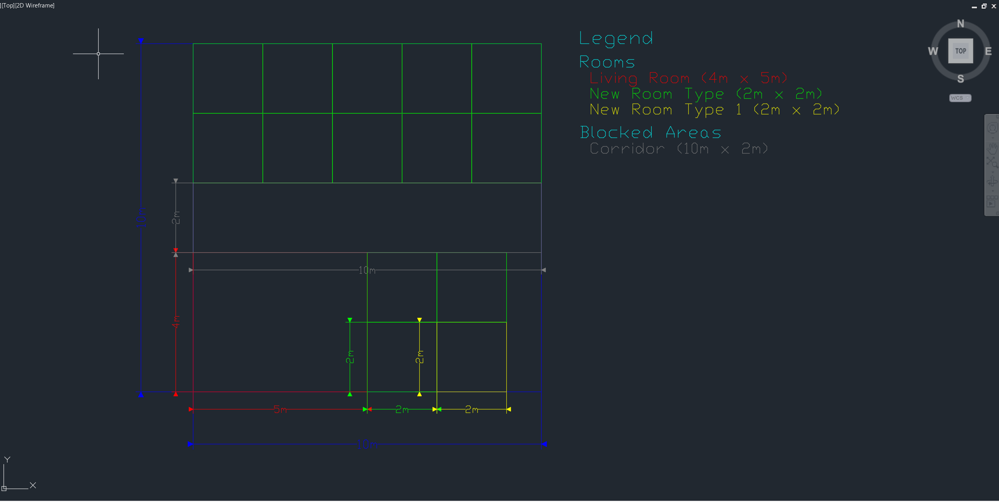

# 🏠 Floor Plan Generator

[](3D%20Floorpan.png)  
*(Click for full-size: Example 3D layout in the app)*

[](AutoCADdxf.png)  
*(Click for full-size: AutoCAD DXF export example)*

---

## What This Tool Does

- **Goal:** Visualize the **top 10** possible room layouts for a given floor area and constraints.
- **Ranking / Sorting:**
  1. **Feasibility:** Layout must include **≥ 1** of **every requested room type**.
  2. **Most Rooms:** Prefer layouts that fit the **highest total number of rooms**.
  3. **Variety (tiebreaker):** Prefer layouts that include a **wider variety** of requested room types.
  4. **Space Use (tiebreaker):** Prefer layouts with **greater total covered area**.
- **Output:** Up to **10** layouts, ordered by the rules above.

---

## Quick Start

1. **Set Floor Area**
   - Define `width` and `height` (meters / centimeters / millimeters).

2. **Add Blocked Areas**
   - Columns, stairs, corridors, shafts, etc.
   - Use presets or custom sizes.

3. **Define Room Types** (see schema below)
   - Name, dimensions, color, and **quantity** (exact or “as many as possible”).

4. **Generate Layouts**
   - Click **Generate Layouts** → algorithm runs and ranks candidates.

5. **Review Top 10**
   - Use **Previous / Next** to browse the best 10 layouts.

6. **View Modes**
   - **2D:** Blueprint view (measurements & adjacency).
   - **3D:** Interactive walkthrough (pan / zoom / rotate).

7. **Export**
   - **JSON:** Full session (inputs + chosen layout).
   - **DXF:** CAD-ready 2D plan for AutoCAD, SketchUp, LibreCAD, etc.

---

## Room Types & Layout Configuration

### Room Type Definition (UI fields)
- **Name:** e.g., `Master Bedroom`, `Kitchen`, `Office`
- **Dimensions:** `width`, `height`
- **Quantity:**
  - A **number** (exact count to fit)
  - **Blank** → generator will try to fit **as many as possible**
- **Color:** visual identifier in 2D/3D

### Example JSON (session export)
```json
{
  "floor": { "width": 12000, "height": 8000, "units": "mm" },
  "blockedAreas": [
    { "x": 2000, "y": 2000, "width": 400, "height": 400, "label": "Column" },
    { "x": 0, "y": 3500, "width": 12000, "height": 1200, "label": "Corridor" }
  ],
  "roomTypes": [
    { "name": "Bedroom", "width": 3300, "height": 3600, "quantity": 2, "color": "#E6A700" },
    { "name": "Kitchen",  "width": 3000, "height": 3000, "quantity": 1, "color": "#1E90FF" },
    { "name": "Bathroom", "width": 2200, "height": 2200, "quantity": "", "color": "#4CAF50" }
  ],
  "layouts": [
    {
      "score": 0.97,
      "rooms": [
        { "name": "Bedroom", "x": 100, "y": 100, "width": 3300, "height": 3600, "rotation": 0 },
        { "name": "Bedroom", "x": 3500, "y": 100, "width": 3300, "height": 3600, "rotation": 90 },
        { "name": "Kitchen",  "x": 100, "y": 4000, "width": 3000, "height": 3000, "rotation": 0 }
      ]
    }
  ]
}
